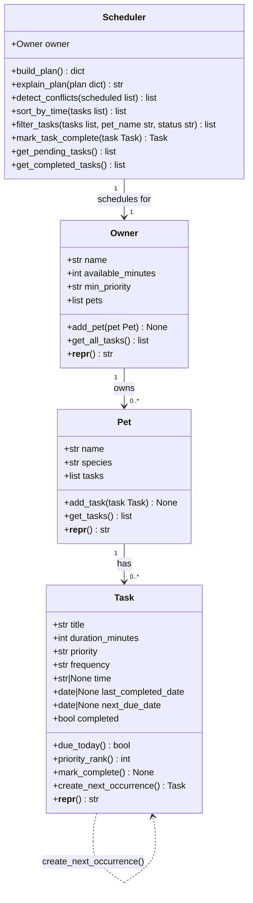

# PawPal+ Class Diagram

```mermaid
classDiagram
    class Task {
        +str title
        +int duration_minutes
        +str priority
        +str frequency
        +str|None time
        +date|None last_completed_date
        +date|None next_due_date
        +bool completed
        +due_today() bool
        +priority_rank() int
        +mark_complete() None
        +create_next_occurrence() Task
        +__repr__() str
    }

    class Pet {
        +str name
        +str species
        +list tasks
        +add_task(task Task) None
        +get_tasks() list
        +__repr__() str
    }

    class Owner {
        +str name
        +int available_minutes
        +str min_priority
        +list pets
        +add_pet(pet Pet) None
        +get_all_tasks() list
        +__repr__() str
    }

    class Scheduler {
        +Owner owner
        +build_plan() dict
        +explain_plan(plan dict) str
        +detect_conflicts(scheduled list) list
        +sort_by_time(tasks list) list
        +filter_tasks(tasks list, pet_name str, status str) list
        +mark_task_complete(task Task) Task
        +get_pending_tasks() list
        +get_completed_tasks() list
    }

    Owner "1" --> "0..*" Pet : owns
    Pet "1" --> "0..*" Task : has
    Scheduler "1" --> "1" Owner : schedules for
    Task ..> Task : create_next_occurrence()
```
