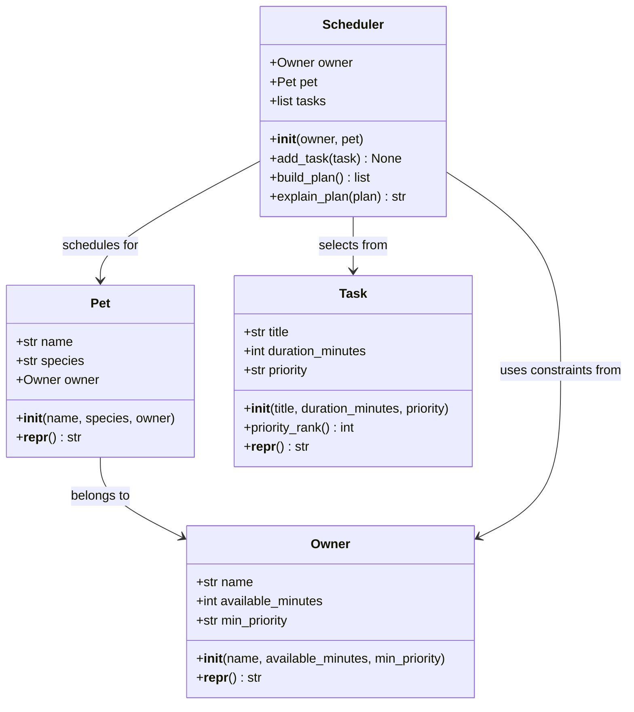

# PawPal+ Class Diagram

```mermaid
classDiagram
    class Owner {
        +str name
        +int available_minutes
        +str min_priority
        +__init__(name, available_minutes, min_priority)
        +__repr__() str
    }

    class Pet {
        +str name
        +str species
        +Owner owner
        +__init__(name, species, owner)
        +__repr__() str
    }

    class Task {
        +str title
        +int duration_minutes
        +str priority
        +__init__(title, duration_minutes, priority)
        +priority_rank() int
        +__repr__() str
    }

    class Scheduler {
        +Owner owner
        +Pet pet
        +list tasks
        +__init__(owner, pet)
        +add_task(task) None
        +build_plan() list
        +explain_plan(plan) str
    }

    Pet --> Owner : belongs to
    Scheduler --> Owner : uses constraints from
    Scheduler --> Pet : schedules for
    Scheduler --> Task : selects from
```
